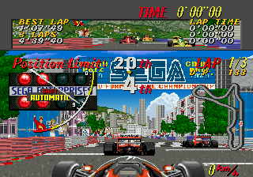
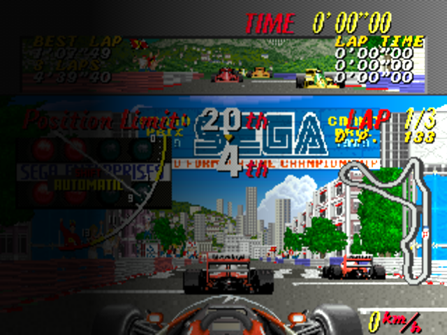

Command line to convert any image to a good boxart for MyMinUI
needs ImageMagick 

this is infile.bmp:

magick infile.bmp -resize 640x480! \( +clone -fx 'i/w < 0.2 ? 0.1 : (i/w - 0.2)*2 +0.1' \) -compose multiply -composite outfile.png

this is the resulting outfile.png ready to copied in the Imgs folder:

Infile.bmp is actually a save state preview taken direclty from the device, state previews are stored in /mnt/sdcard/.userdata/shared/.minui/<EMU_FOLDER>/<gamename>.<ext>.<slot>.bmp